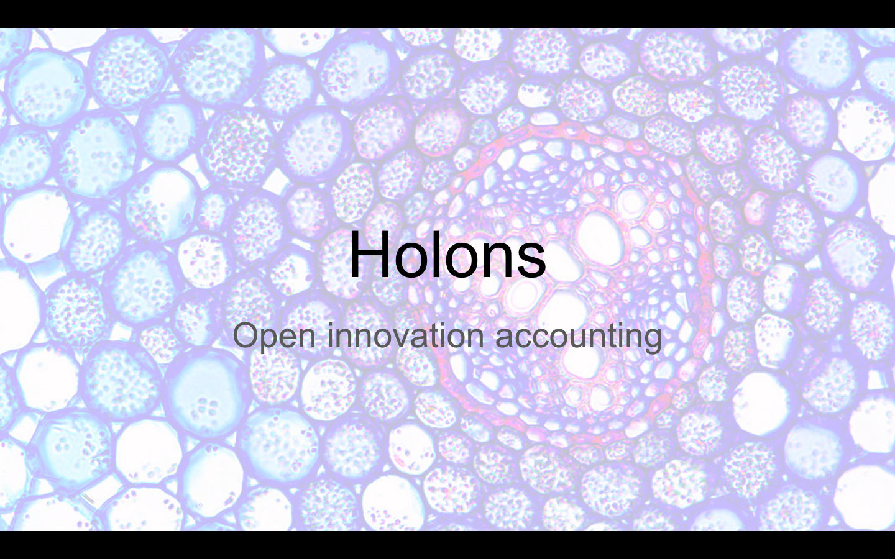
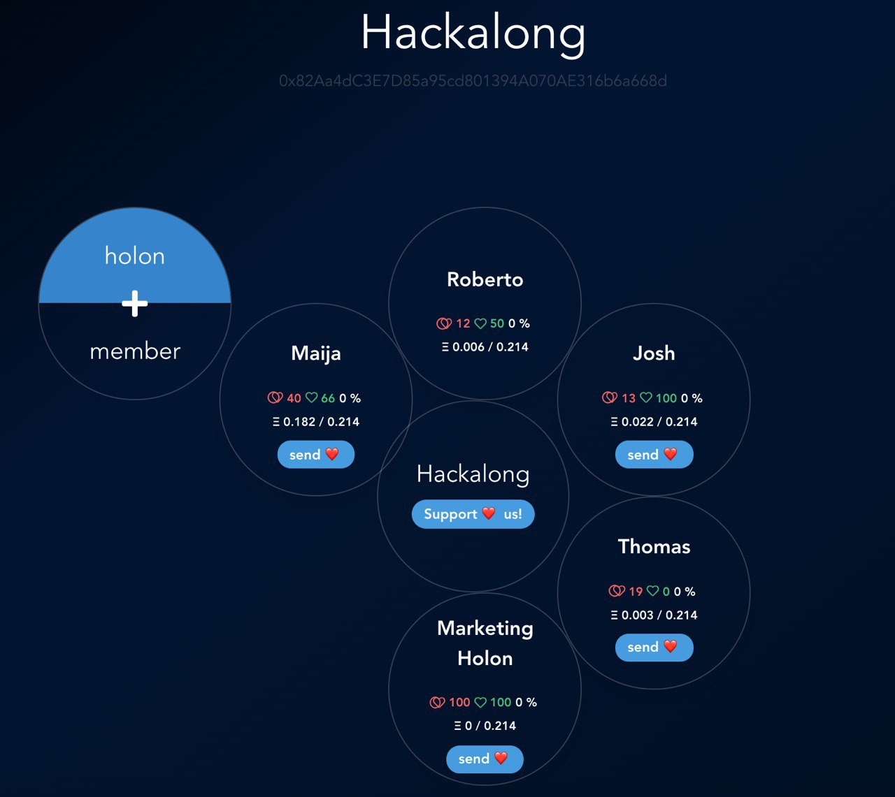
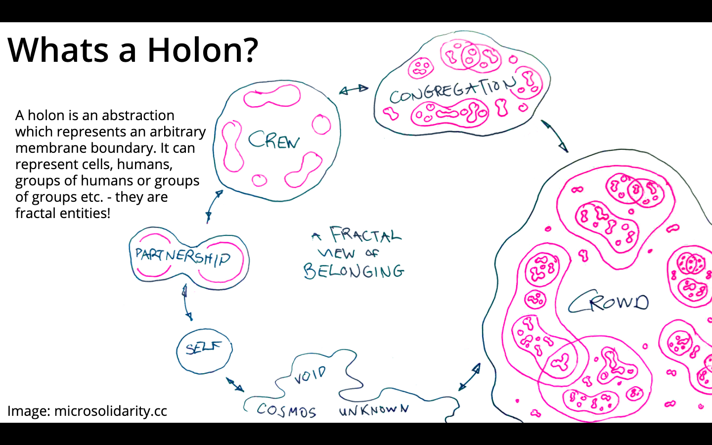
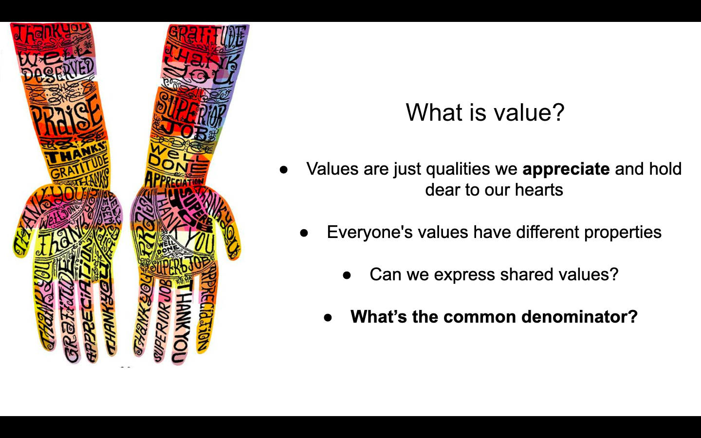
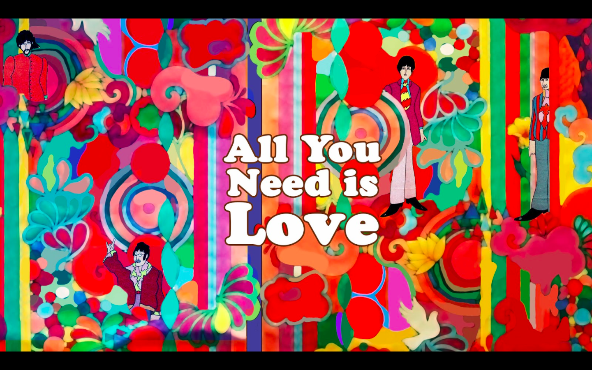
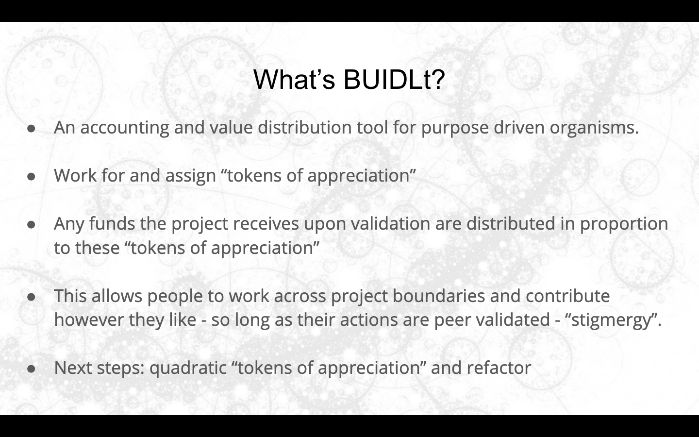
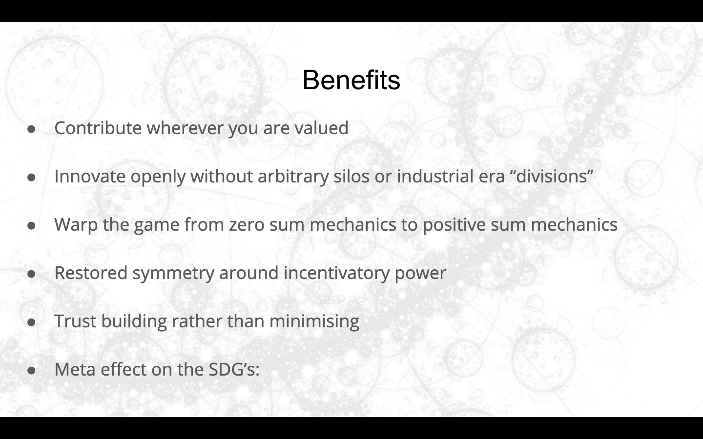
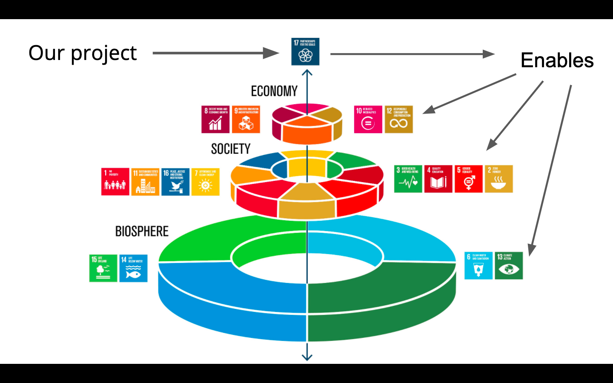

# Hack-along Holons - aka Team of teams
<!-- ALL-CONTRIBUTORS-BADGE:START - Do not remove or modify this section -->

<!-- ALL-CONTRIBUTORS-BADGE:END -->

### Create and join teams, delegate appreciation, share the rewards!
--------

How can we value a plurality of contributions and encourage open innovation?
How can we enhance trust in open innovation?
How can we warp the game from zero sum hackathons to positive sum hackalongs?

### Presentation

--------
### User Personas

1) As a designer, Marko wants to help people perfect their value proposition so that they build something worth while for humanity

2) As a care worker, Kris wants to ensure people he cares about have their emotional needs met and create an atmosphere of positivity so that people are content and undistracted

3) As a business developer, Lua wants to round up a network so that when the product is delivered there can be a continuation of group activity

4) As a computer scientist, Ome wants to ensure that the logic of whatever is getting built has internal consistancy, is rigerous and robust and anything but sloppy, so that the work once completed can stand on its own

5) As a developer, Roberto wants to see a consistent codebase that is modular and reusable so that each module can be recontextualised and upcycled across projects as they develop

6) As a security specialist, Ralph wants to see that potential attack surfaces within the app are sealed so that no one looses funds or exploits the application and tarnishes the groups reputation.

7) As a pollinator, Kay wants to hop about various groups and contribute his tooling talents with in a piecemeal style so that he can meet new people make friends and contribute value in a very breezy style

8) As a deep worker, Andrej wants to challenge peoples priorities and help them decide whats actually improtant to work on so that the group can apply their talents in an appropriate direction

9) As a peace maker, wants to align stakeholder interest in an egalatarian manner so that conflict is minimised

----------

### Zero sum hackathons

When collaborating at hackathons we've often noticed that the incentivatory power of the extrinsic motivator otherwise known as prize money, creates a zero-sum effect where teams become focused on their own thing and self isolate within their own group identity creating a number of pathologies.

The boundaries go up and silos appear, if you win, then we loose - so why should we help you obtain the prize we want?... This is not what the crypto space was supposed to become - but the incongruency becomes apparent at every hackathon as we prioritise skills and roles that will help "our team" win. In a nutshell a scarcity mentality causes us to close our source and become inhuman silos.

Should the games we play in this space be zero-sum? We espouse "alignment of interests" at every turn but looking at our track record of hackathons we're completely incongruent.

### Positive sum Hackalongs - The appreciative soloution
Looking at the personas above, its pretty apparent that people want to get out of their silos - its just that the hackathon game needs warping. How can we make these events positive sum?

Our suggestion is to make them Hackalongs, not hackthons. Lets change the incentive model and put emphasis on valuing collaboration over competition!

**How can we do this?** Simple - we tokenise the most general form of value (peoples appreciation for eachother) and distribute prize money along these lines of trust !

### Conrete example
Kay is a part of a team of four. They have decided to incentivise collaboration and assign 20% of their **potential** prize money to this cause.

His friend Peter is also part of a team of four. They have also decided to incentivise collaboration and assign 20% of their **potential** prize money to this cause.

While wandering off to grab a beer, Kay meets Peter who's team are lacking an idea still so Kay helps them get the ball rolling with his whacky ideas. The four members of Peters team sends Kay 50% of each members "appreciation budget".

Kay returns to his team and finishes the hack they place first, while Peters team comes second.

If 1st place is $500 then Kays team distributes 20% of that to who ever they assigned their appreciation to. Kay recieves $100 for his efforts there.

If 2nd place is $250 and Peters team bugeted 20% of their prize money for appreciated contributions and Kay was delegated 50% of each members "appreciation allowance", then Kay will recieve 10% of the total prize money - an extra $25!

Kay walks away a happy hacker with $125 total, a quarter more than his team members who just concentrated on their own work.

## Contributors ✨

Thanks goes to these wonderful people ([emoji key](https://allcontributors.org/docs/en/emoji-key)):

<!-- ALL-CONTRIBUTORS-LIST:START - Do not remove or modify this section -->
<!-- prettier-ignore-start -->
<!-- markdownlint-disable -->
<table>
  <tr>
    <td align="center"><a href="http://maijagrudule.com/"> <b>Maija Grudule</b></a> <a href="https://github.com/hack-along/hack-along-holons/commits?author=MGrudule" title="Code">💻</a> <a href="#design-MGrudule" title="Design">🎨</a></td>
  </tr>
</table>

<!-- markdownlint-enable -->
<!-- prettier-ignore-end -->
<!-- ALL-CONTRIBUTORS-LIST:END -->

This project follows the [all-contributors](https://github.com/all-contributors/all-contributors) specification. Contributions of any kind welcome!